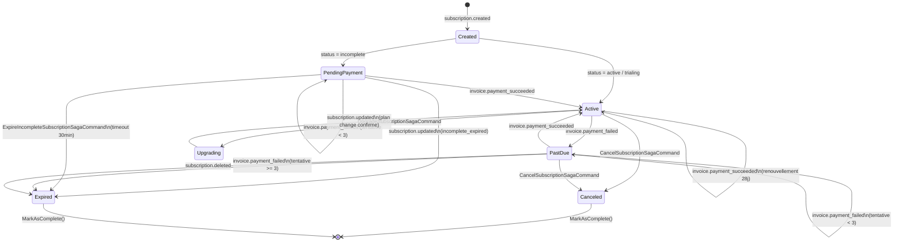
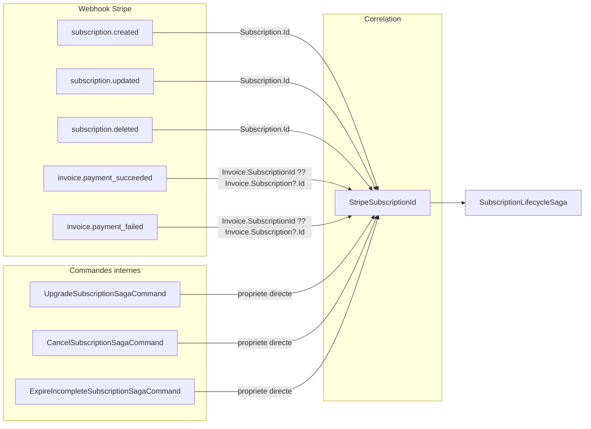
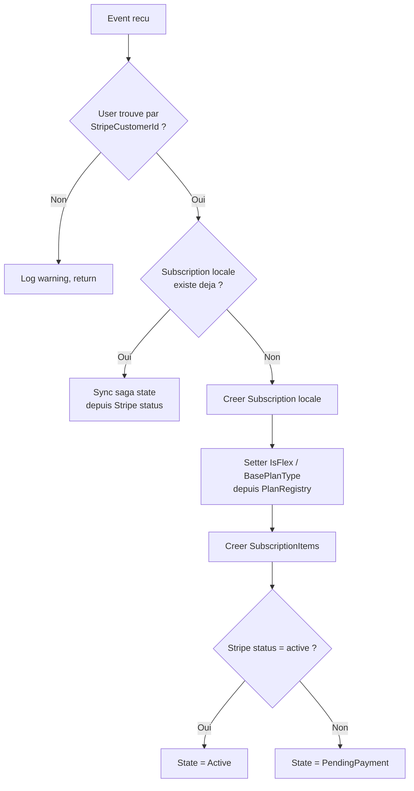
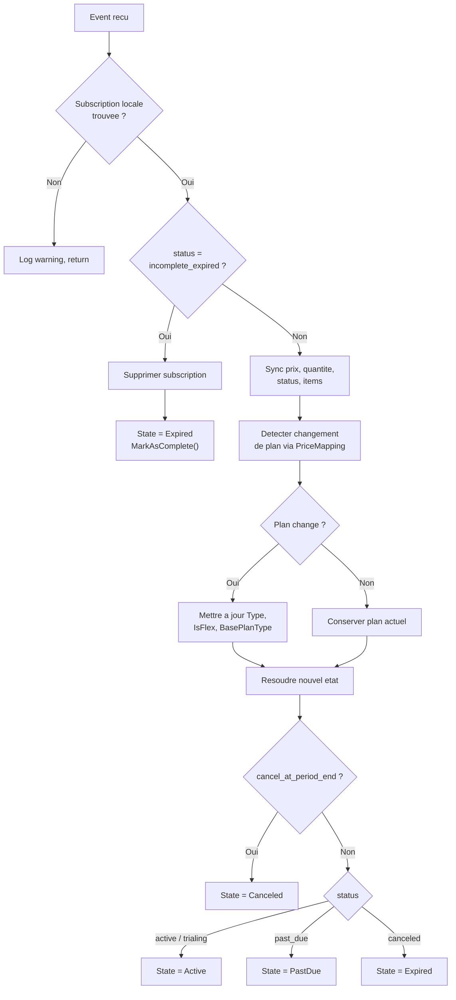
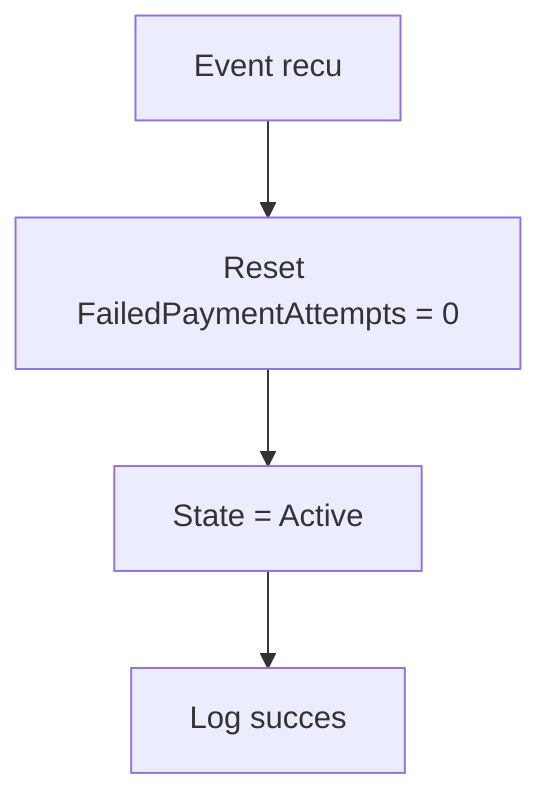
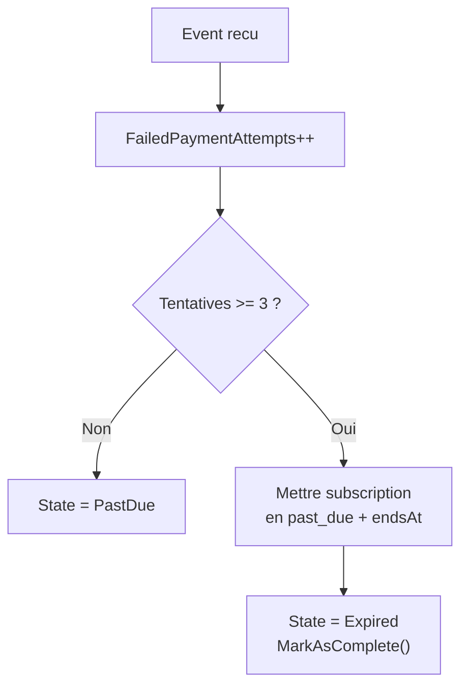
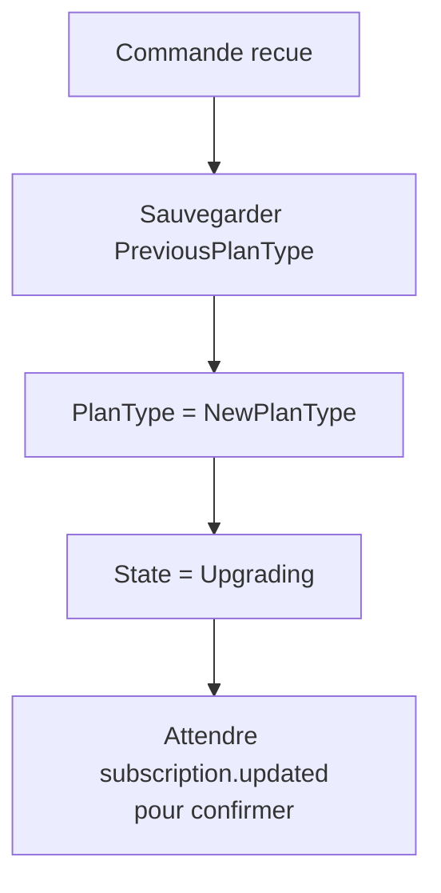
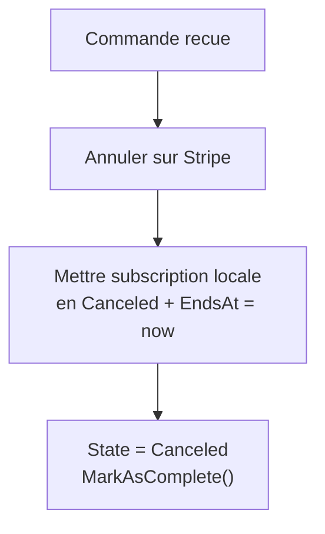
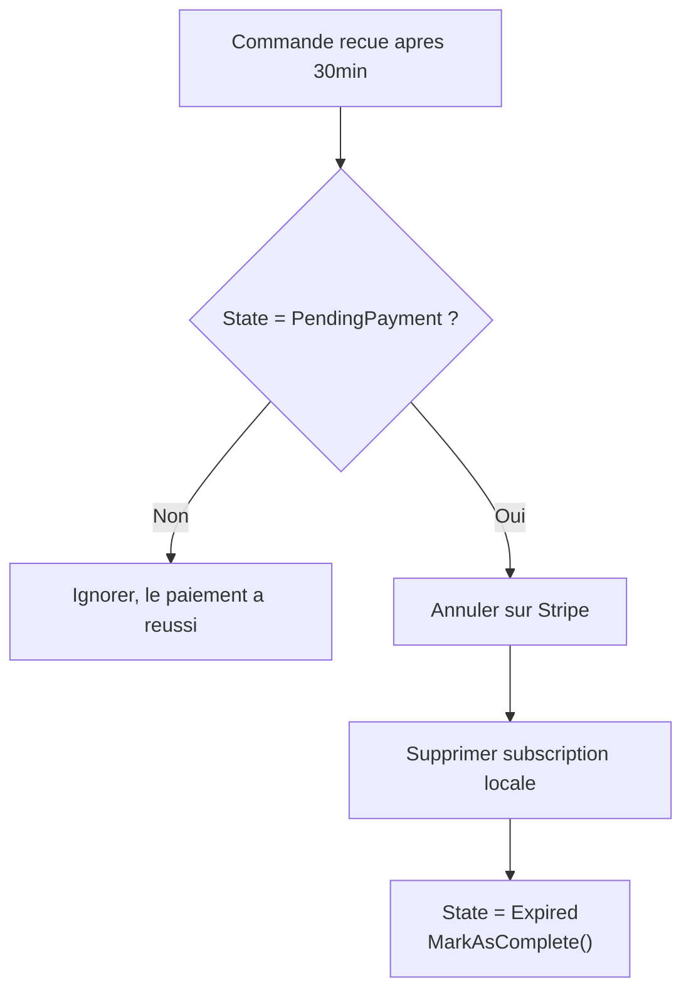
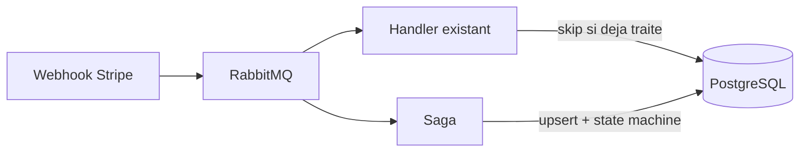

# Subscription Lifecycle Saga

## Vue d'ensemble

La `SubscriptionLifecycleSaga` orchestre le cycle de vie complet d'un abonnement CarWashFlow via Rebus. Elle est correlee par `StripeSubscriptionId` et reagit aux evenements Stripe webhook ainsi qu'aux commandes internes (upgrade, cancel).

---

## Machine d'etats



---

## Messages et correlation

Tous les messages portent un champ `EventJson`. La saga extrait le `StripeSubscriptionId` pour la correlation :



---

## Detail des transitions

### `subscription.created` (IAmInitiatedBy)



### `subscription.updated`



### `invoice.payment_succeeded`



### `invoice.payment_failed`



### `UpgradeSubscriptionSagaCommand`



### `CancelSubscriptionSagaCommand`

L'annulation est toujours immediate. Le `CancelSubscriptionCommandHandler` desactive d'abord la subscription en base (status = Canceled, EndsAt = now), puis envoie la commande saga pour annuler cote Stripe.



### `ExpireIncompleteSubscriptionSagaCommand`

Commande differee (30 min) programmee lors de la creation d'une subscription incomplete. Si la saga est toujours en `PendingPayment` a reception, elle annule la subscription sur Stripe, supprime la subscription locale et termine la saga.



---

## Saga Data

| Champ | Type | Description |
|-------|------|-------------|
| `StripeSubscriptionId` | `string` | Cle de correlation |
| `UserId` | `Guid` | Proprietaire de l'abonnement |
| `LocalSubscriptionId` | `Guid` | ID de la Subscription locale |
| `StripeCustomerId` | `string` | ID client Stripe |
| `PlanType` | `string` | Type de plan actuel (ex: `comfort_flex`) |
| `PreviousPlanType` | `string?` | Plan precedent lors d'un upgrade |
| `CurrentState` | `string` | Etat courant de la machine d'etats |
| `FailedPaymentAttempts` | `int` | Compteur d'echecs de paiement consecutifs |
| `LastPaymentFailedAt` | `DateTimeOffset?` | Date du dernier echec |
| `CreatedAt` | `DateTimeOffset` | Date de creation de la saga |
| `UpdatedAt` | `DateTimeOffset` | Derniere mise a jour |

---

## Coexistence avec les handlers existants

Pendant la phase de transition, les anciens handlers Rebus (`CustomerSubscriptionCreatedHandler`, `CustomerSubscriptionUpdatedHandler`, etc.) et la saga recoivent les memes evenements :



- La saga gere les **nouvelles** souscriptions (`IAmInitiatedBy<SubscriptionCreated>`)
- Les handlers existants verifient si la subscription existe deja avant d'agir
- **Phase 3** : suppression des 5 handlers remplaces par la saga

---

## Plans d'abonnement

| Type | Nom | Prix / 28j | Vehicules | Acces | Flex de |
|------|-----|-----------|-----------|-------|---------|
| `comfort` | Confort | 21,99 EUR TVAC | 1 | Heures creuses | - |
| `comfort_flex` | Confort Flex | 30,99 EUR TVAC | 1 | 24/7 | `comfort` |
| `family` | Famille | 28,99 EUR TVAC | 2 | Heures creuses | - |
| `family_flex` | Famille Flex | 37,99 EUR TVAC | 2 | 24/7 | `family` |
| `pro` | Pro | 26,00 EUR HTVA | 1 | 24/7 | - |

---

## Fichiers source

```
Infrastructure/Stripe/Sagas/
  SubscriptionLifecycleSaga.cs        # Saga principale
  SubscriptionLifecycleSagaData.cs    # Donnees + etats
  SagaCommands.cs                      # Commandes internes
```
